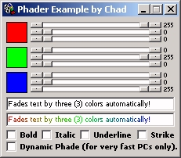



## Phader Example by Chad

### Description

This is a full Text Fader Example allowing you to fade text by three (3) colors. It uses nine (9) scrollbars (3 for each color to fade by) allowing you to set the color of each of three (3) Color Labels. It has a great Fade Preview so you can see what the Faded Text looks like as you type it. It also has Bold, Italic, Underline and Strike Through options that can be changed real time (the Faded Text Preview updates as you change the options). There is also a very cool option that Dynamically updates the Faded Text Preview as you change or scroll any of the color scrollbars. If enabled, it allows you to change the colors dynamically and see what the Faded Text looks like instantly. It does, however, require a fairly fast PC with at least 256MBs of RAM. It doesn't slow down your PC or eat up memory, slower PCs just don't scroll the scrollbars smoothly and the RGB values jump in large increments instead of smoothly by 1 if the Dynamic Option is enabled. This is a perfect start for an AOL Chat Fader or any other type of Chat Fader.
 
### More Info
 
You simply scroll the color scrollbars to set each of three (3) Color Labels. As you scroll each srollbar, the RGB value is shown beside each one. Once you have all three (3) Color Labels set to the color you want, you start typing the text to fade and it automatically fades and shows up in a Preview box exactly how it will appear when it is faded.

There really isn't anything to know. I did not comment the code because it is so easy to understand, anyone can understand and use it. This example is the perfect start for a very nice AOL Chat Fader (or any other Chat Fader) and can be easily changed to fade by more or less colors.

Each scrollbar returs it's RGB value in a label beside them and as you type, the Faded Text is Previewed in a Rich Text Box. If you expand the form downwards, you will see a text box that has all the color HTML used to create the Faded Text Preview. This can be copied into a webpage for Faded Text in a website.

No side effects at all unless the Dynamic option is checked. With it checked, it really isn't a side effect, it just makes the scrollbars and RGB values jump in large increments instead of scrolling smoothly by 1. PCs with 1Ghz+ Processors and 256MBs+ of RAM should not experience any side effects at all.

             |
---                |---
**Submitted On**   |2005-02-04 16:38:36
**By**             |[Chad Roe](https://github.com/Planet-Source-Code/PSCIndex/blob/master/ByAuthor/chad-roe.md)
**Level**          |Beginner
**User Rating**    |5.0 (20 globes from 4 users)
**Compatibility**  |VB 3\.0, VB 4\.0 \(16\-bit\), VB 4\.0 \(32\-bit\), VB 5\.0, VB 6\.0
**Category**       |[Miscellaneous](https://github.com/Planet-Source-Code/PSCIndex/blob/master/ByCategory/miscellaneous__1-1.md)
**World**          |[Visual Basic](https://github.com/Planet-Source-Code/PSCIndex/blob/master/ByWorld/visual-basic.md)
**Archive File**   |[Phader\_Exa184832242005\.zip](https://github.com/Planet-Source-Code/chad-roe-phader-example-by-chad__1-58694/archive/master.zip)

